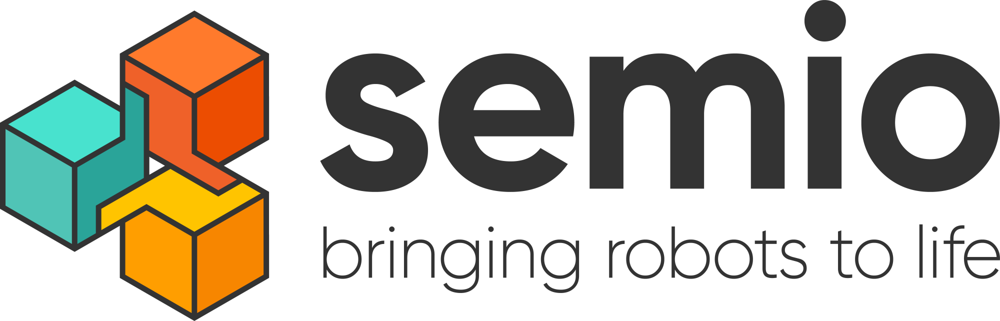
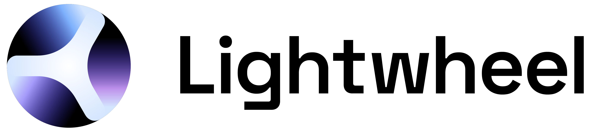
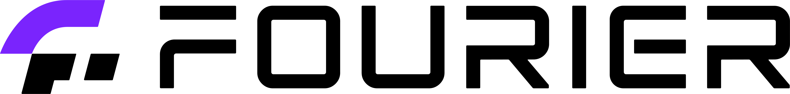
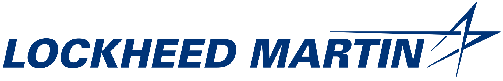
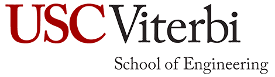

  The registration portal is now open! Click <a href="{{ site.baseurl }}/attending/registration/" style="color: #0000EE; text-decoration: underline;">here</a> for details.

<h1 class="page-title">{{ site.title }} 
June 21 &ndash; June 25, 2025 Los Angeles, California</h1>

  
Jul 11

<!-- ### Important Announcements

**Announcement 1:** In response to the recent wildfires in Los Angeles, we have made adjustments to the RSS 2025 submission timeline, to show our support to the LA community who is going to generously host us this June. While the abstract/title submission (January 17) and the initial paper submission (January 24) deadlines remain unchanged, the authors will be able to continue updating the pdf of their paper until January 31, 2025 (which is also the supplementary material deadline). For more details, read our [full announcement](/updates/la-wildfires/).

**Announcement 2:** Submitting an abstract (by the January 17 deadline) or a semi-complete paper (by the January 24 deadline) for a paper that is currently under submission to another conference (e.g. ICRA, ICLR, CVPR) is still considered a double submission and is forbidden by RSS rules. However, if the paper has substantial innovation with respect to the paper that is already in submission (i.e., it would qualify as a different and novel paper and you would not withdraw it even if the paper under review is accepted), you should feel free to submit it to RSS. -->

### News and Updates

- Registration portal is open [here]({{ site.baseurl }}/attending/registration/).
- Travel Information is available [here]({{ site.baseurl }}/attending/travel/).

---

### Call for Participation

We are pleased to announce the 21st edition of the “Robotics: Science and Systems” (RSS) conference to be held at the [University of Southern California](https://www.usc.edu/){:target="_blank"}, Los Angeles, California from June 21-25, 2025. 
After being hosted at the University of Southern California in 2011, the organizers are excited to bring RSS back to this iconic venue in 2025.

RSS has a long history of bringing together researchers in all areas of robotics from around the world for an engaging and focused week of single-track presentations, workshops, poster sessions, and tutorials. This year, as always, we solicit your best work.

### Important Dates

<table class="table">
    <thead>
      <tr>
        <th colspan="3">Timeline</th>
      </tr>
    </thead>
    <tbody>
      <tr>
        <td>January 17, 2025</td>
        <td class="nowrap">11:59pm <a href="https://time.is/Anywhere_on_Earth">AoE</a></td>
        <td class="wrap">Abstract/Title Submission Deadline</td>
      </tr>
      <tr>
        <td>January 24, 2025</td>
        <td class="nowrap">11:59pm <a href="https://time.is/Anywhere_on_Earth">AoE</a></td>
        <td class="wrap">Initial Paper and Demo Submission Deadline (this requires a semi-complete pdf of the paper, final title and abstract)</td>
      </tr>
      <tr>
        <td>January 31, 2025</td>
        <td class="nowrap">11:59pm <a href="https://time.is/Anywhere_on_Earth">AoE</a></td>
        <td class="wrap">Final PDF Submission Deadline</td>
      </tr>
      <tr>
        <td>January 31, 2025</td>
        <td class="nowrap">11:59pm <a href="https://time.is/Anywhere_on_Earth">AoE</a></td>
        <td class="wrap">Supplementary Material Submission Deadline</td>
      </tr>
      <tr>
        <td>February 11, 2025</td>
        <td class="nowrap">11:59pm <a href="https://time.is/Anywhere_on_Earth">AoE</a></td>
        <td class="wrap"><a href="https://sites.google.com/view/rsspioneers2025/" target="_blank">RSS Pioneers</a> Application Deadline</td>
      </tr>
      <tr>
        <td>February 16, 2025</td>
        <td class="nowrap">11:59pm <a href="https://time.is/Anywhere_on_Earth">AoE</a></td>
        <td class="wrap">Workshop Proposal Deadline</td>
      </tr>
      <tr>
        <td>March 17, 2025</td>
        <td class="nowrap">11:59pm <a href="https://time.is/Anywhere_on_Earth">AoE</a></td>
        <td class="wrap">Reviews Released and Rebuttal Invitations</td>
      </tr>
      <tr>
        <td>March 22, 2025</td>
        <td class="nowrap">11:59pm <a href="https://time.is/Anywhere_on_Earth">AoE</a></td>
        <td class="wrap">Workshop Decisions Announcement</td>
      </tr>
      <tr>
        <td>March 24, 2025</td>
        <td class="nowrap">11:59pm <a href="https://time.is/Anywhere_on_Earth">AoE</a></td>
        <td class="wrap">Rebuttal Submission Deadline</td>
      </tr>
      <tr>
        <td>April 10, 2025</td>
        <td class="nowrap">11:59pm <a href="https://time.is/Anywhere_on_Earth">AoE</a></td>
        <td class="wrap">Paper and Demo Acceptance Notification</td>
      </tr>
      <tr>
        <td>April 20, 2025</td>
        <td class="nowrap">11:59pm <a href="https://time.is/Anywhere_on_Earth">AoE</a></td>
        <td class="wrap"><a href="https://sites.google.com/view/rsspioneers2025/" target="_blank">RSS Pioneers</a> Notification of Acceptance</td>
      </tr>
      <tr>
        <td>April 25, 2025</td>
        <td class="nowrap">11:59pm <a href="https://time.is/Anywhere_on_Earth">AoE</a></td>
        <td class="wrap">Final Camera Ready Paper Submission</td>
      </tr>
      <tr>
        <td>June 20, 2025</td>
        <td>—</td>
        <td class="wrap"><a href="https://sites.google.com/view/rsspioneers2025/" target="_blank">RSS Pioneers</a> Workshop</td>
      </tr>
      <tr>
        <td>June 21 &ndash; June 25, 2025</td>
        <td>—</td>
        <td class="wrap">RSS 2025, Los Angeles, California</td>
      </tr>
    </tbody>
</table>

  
  

 

---

<h3 id="sponsors">Sponsors</h3>

<!-- Row 1 -->

  

<!-- Row 2 -->

  

<!-- Row 3 -->

  
  

<!-- Row 4 -->

  
  
  

<!-- Row 5 -->

  
  
  

<!-- Row 6 -->

  
  
  

<!-- Row 7 -->

  
  
  

<!-- Row 8 -->

  
  

---
The website of the RSS 2024 conference can be found [here]({{ site.baseurl }}/2024/).

 
 
 
 
 
